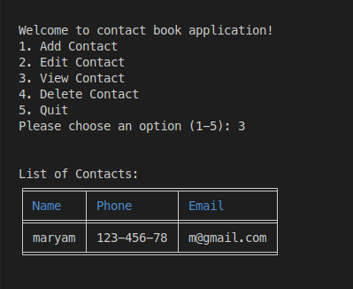

# Contact Book
This project is specially curated for the intermediate Python learners, aiming to highlight the vital role of CRUD(Create, Read, Update, Delete) operation in database managment. A database is a systematic collection of data, making the process of data managment more streamlined.

